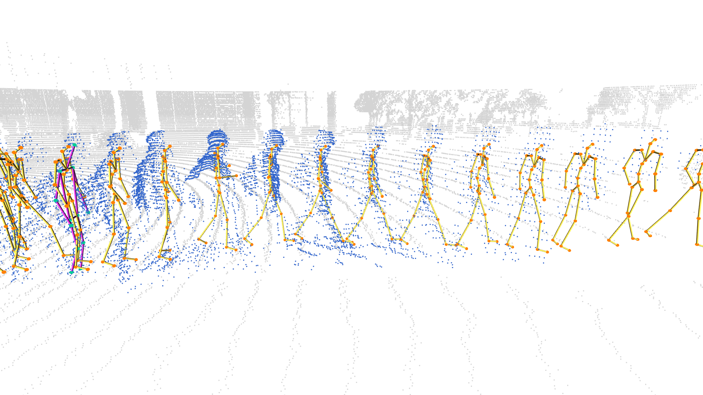
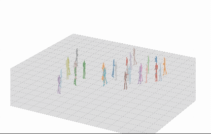
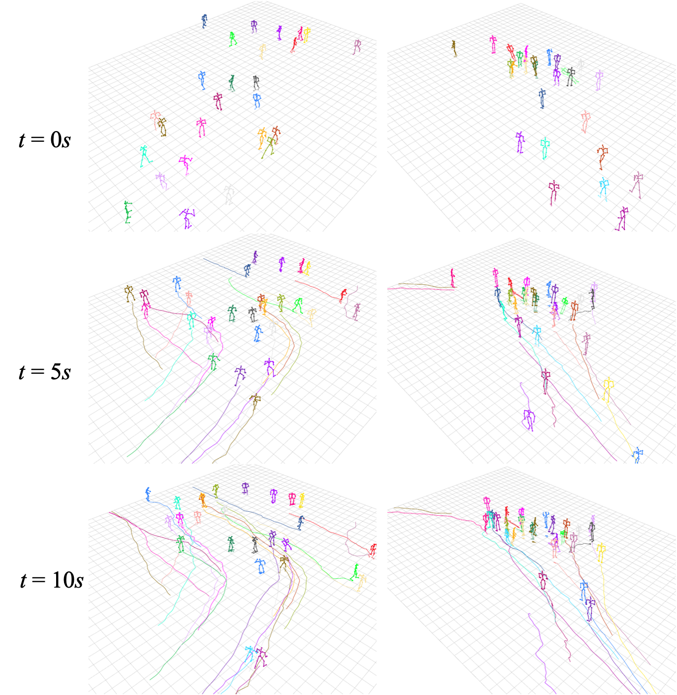
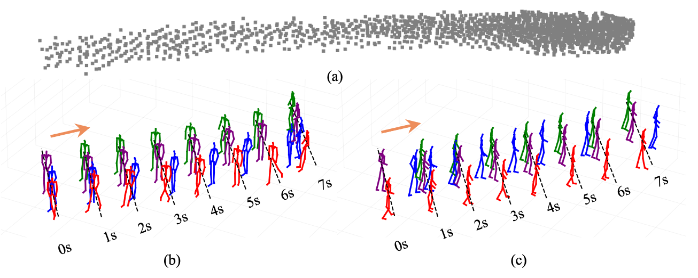

# Waymo-3DSkelMo
A Multi-Agent 3D Skeletal Motion Dataset for Pedestrian Interaction Modeling in Autonomous Driving

## 🗂️ Dataset Overview

   
  <em>Visualization of Waymo-3DSkelMo.</em>

## 📦 Resources

The code and full dataset will be available soon!  
In the meantime, you can download an example from [Google Drive](https://drive.google.com/drive/folders/1uoImDQZKVnr_Evrru5nyS1sI85mVP-af?usp=sharing).

## 🎞️ Demo Visualization
<!-- <table style="width: 100%;">
  <tr>
    <td style="width: 50%; text-align: center;">
      
      
Example scene of multi-agent interaction from the Waymo-3DSkelMo dataset.

    </td>
    <td style="width: 100%; text-align: center;">
      
    
NeMF-based (orange) vs. LiDAR-HMR Raw Output

    </td>
  </tr>
</table> -->

   
  <em>Example scene of multi-agent interaction from the Waymo-3DSkelMo dataset.</em>

   
  <em>NeMF-based (orange) vs. LiDAR-HMR Raw Output</em>

   
  <em>Interactions of agents in the same scene at different timestamps.</em>

   
  <em>Visualization of 3D Skeletal Motion Reconstructed from Low-Quality Point Cloud Sequences Using Different Methods.</em>

